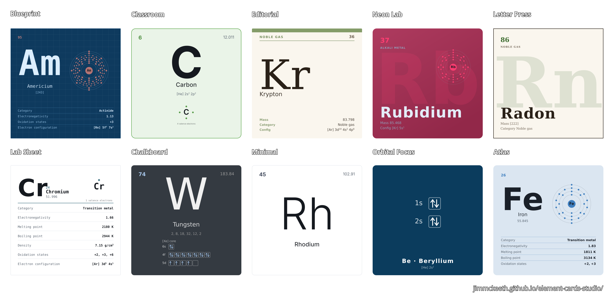

# Element Card Studio

Generate,customize, and download periodic-table element cards that are
chemically accurate *and* worth putting on a wall. Right from the browser. 
No build step, no dependencies, so it deploys to GitHub Pages or runs locally.



## What it does

**Pick any of the 118 elements** from an interactive periodic table, then shape the card:

| | |
|---|---|
| **Layouts** | Classic tile, Modern, Study card, Poster, Data sheet, Diagram-first |
| **Diagrams** | Lewis electron dot, Bohr shell, orbital box (full or valence-only) |
| **Color** | 9 palettes × 7 paper themes × 6 accent treatments; color by category, block, state or a fixed color |
| **Type** | 20 typefaces, independent symbol and text fonts, weight, size, letter-spacing |
| **Data** | 20 properties placed in four corner slots and a detail list, in the order you choose |
| **Frame** | Size, aspect presets, padding, corner radius, border, drop shadow |
| **Export** | SVG, PNG, and lossless WebP at 1×–8×, with optional transparency |

Twelve curated presets (Classroom, Editorial, Blueprint, Neon lab, Letterpress, Lab sheet,
Chalkboard, Minimal, Atlas, Orbital focus, Bad Hal, Basic Blue) are starting points rather
than destinations — they change the look and leave your element and card size alone, and
every color and corner value stays adjustable afterward.

Shift-click elements in the table to build a selection, then **export a contact sheet**
of all of them in one file.

Every design is captured in the URL, so "Copy link" produces a link that restores the
exact card. Your last design is also remembered locally.

## Accuracy

The diagrams are not decoration drawn to look plausible — all of them are derived from
one stored ground-state electron configuration per element, so they cannot contradict
each other:

- **Configurations** use noble-gas shorthand and encode the known aufbau anomalies
  explicitly (Cr, Cu, Nb, Mo, Ru, Rh, Pd, Ag, La, Ce, Gd, Pt, Au, Ac, Th, Pa, U, Np,
  Cm, Lr). A test asserts every configuration sums to Z and that no subshell exceeds
  2(2*l*+1) electrons.
- **Orbital box diagrams** are drawn in aufbau (Madelung) order and filled by Hund's
  rule — every orbital in a subshell takes a spin-up electron before any orbital pairs.
- **Lewis structures** place valence electrons one per side before any side pairs up.
  The valence shell is taken from the element's *period*, not simply its largest
  occupied *n*: palladium is [Kr] 4d¹⁰ with an empty 5s, so its outermost occupied
  shell belongs to the krypton core. Lewis structures are conventionally a main-group
  tool, and the app says so when you select a d- or f-block element.
- **Shell diagrams** show electrons per principal shell, computed from the same source.
- **Atomic weights** follow IUPAC. A value in brackets — [98] for technetium — is the
  mass number of the most stable known isotope rather than a standard atomic weight.
- Properties for the superheavy elements are sparse by nature. Missing values are
  omitted rather than guessed, and configurations beyond Z 103 are marked as predicted.

## Exports

**SVG** is vector and editable. Text is positioned from measured glyph metrics rather
than `dominant-baseline`, so it stays centered in Illustrator and Inkscape as well as in
a browser, and superscripts are real raised tspans instead of precomposed characters
that a font might not carry.

**PNG** is lossless with an alpha channel. Use 4× or more for print.

**WebP** is genuinely lossless and — unlike the browser's own WebP encoder — actually
smaller than the PNG. The browser's built-in `canvas.toBlob(..., 'image/webp', 1)` does
encode losslessly (it writes a real `VP8L` chunk and the pixels round-trip exactly), but
at such low compression effort that a typical export comes out 100x or more larger than
necessary, often bigger than the PNG it's meant to be a smaller alternative to — there's
no way to raise that effort through the Canvas API. So the app carries its own copy of
`libwebp`, compiled to WebAssembly (`js/vendor/webp-enc/`, from Google's
[Squoosh](https://github.com/GoogleChromeLabs/squoosh) project), and calls it directly
with `lossless: 1, exact: 1` in a Worker so a large export doesn't freeze the page. Each
exported file's RIFF chunks are still inspected afterward as a sanity check — if it ever
came back as a lossy `VP8 ` chunk instead of `VP8L`, the app would tell you and point you
at PNG, though in practice that path is now unreachable outside a browser with no
WebAssembly at all.

Rasterizing an SVG through an `` deliberately does not fetch external resources,
web fonts included, so before any PNG or WebP is produced the fonts in use are fetched,
base64-encoded and inlined as `@font-face` rules. Without that step every raster export
would silently fall back to a system font. Embedding is optional for SVG downloads,
where it trades file size for portability. If the fonts cannot be reached the export
still succeeds, with a warning, using system fallbacks.

## Deploying

The repository is the site. Push to `main` and the included workflow publishes it:

1. **Settings → Pages → Build and deployment → Source: GitHub Actions**
2. Push to `main`. `.github/workflows/pages.yml` uploads the repository and deploys it.

There is nothing to compile and no `node_modules`. `.nojekyll` keeps Pages from
filtering the files.

## Running locally

ES modules need a real origin, so open it through a server rather than `file://`:

```sh
python3 -m http.server 8000   # then visit http://localhost:8000
```

## Tests

```sh
node test/run.mjs
```

28 checks covering the dataset, the chemistry derivations, field formatting and the
renderer — including a pass that renders all 118 elements in every layout and diagram
combination and asserts the markup is well-formed.

## Project structure

```
index.html          markup and control scaffolding
css/style.css       application chrome (deliberately neutral so the cards stand out)
js/elements.js      the 118-element dataset
js/chem.js          configuration parsing, shells, valence, Lewis, orbital filling
js/diagrams.js      SVG generators for each diagram, in their own coordinate space
js/theme.js         palettes, paper themes, fonts, layouts, presets, color maths
js/fields.js        every displayable property and its formatter
js/render.js        card composition — six layouts over a shared geometry system
js/export.js        font inlining, rasterizing, WebP verification, downloads
js/webpEncoder.js   the app-side handle to the WebP encoder Worker
js/webpWorker.js    runs the vendored libwebp WASM encoder off the main thread
js/vendor/webp-enc/ vendored libwebp-as-WASM (see the NOTICE there)
js/app.js           state, controls, the periodic table picker, wiring
test/run.mjs        dependency-free test suite
```

## License & Copyright

Copyright © 2026 by Jim McKeeth - [GNU Affero General Public License v3.0](LICENSE.md)

`js/vendor/webp-enc/` carries a vendored copy of Google's `libwebp`, compiled to
WebAssembly by the Squoosh project (BSD-3-Clause / Apache-2.0 — see the license files
in that directory), used to encode WebP exports. It is not covered by the AGPL license
above.
